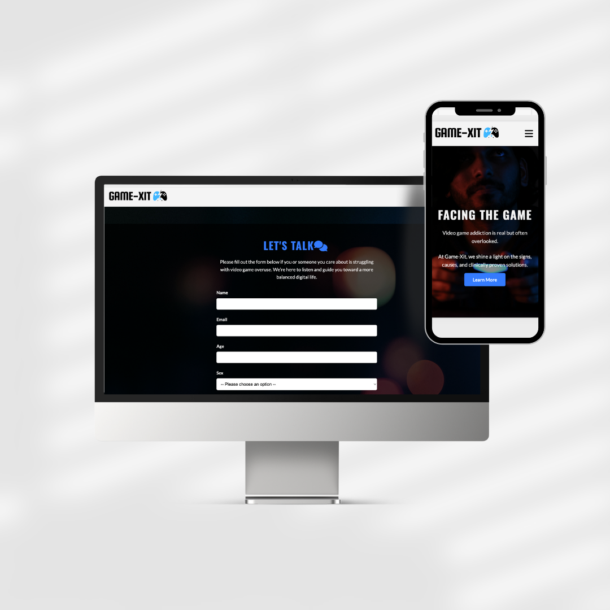
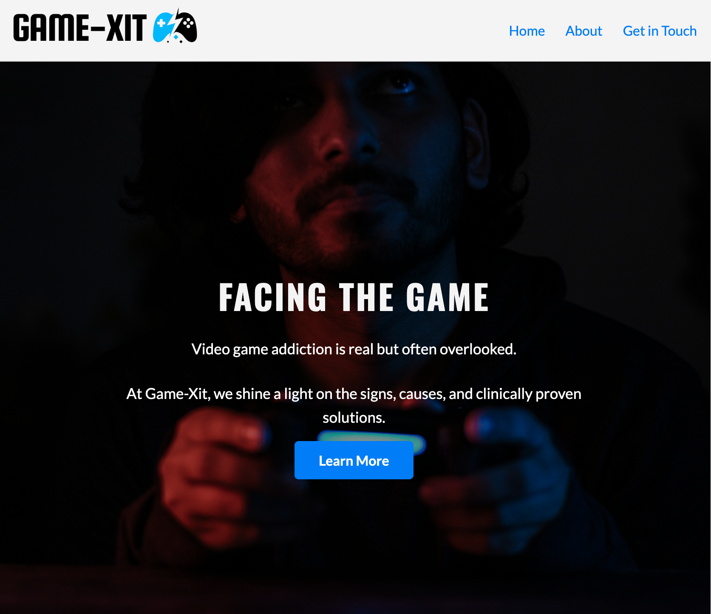
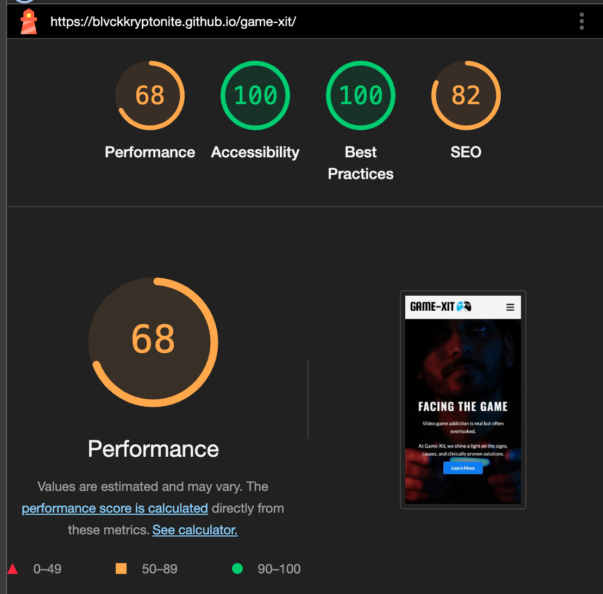

# GAME-XIT

Game-Xit (short for "Game Exit") is a three-page website designed to raise awareness about video game addiction and offer support to individuals of all ages struggling with this issue.

Visitors to the site can find general information about gaming addiction on the Home page, with more detailed insights available in the About section. The website also provides help through a link to a gaming self-assessment tool and a Contact form where users can connect with a Game-Xit team member for personalized assistance.

- **Live Site**: [View Here](https://blvckkryptonite.github.io/game-xit/)
- **Repository**: [GitHub Repo](https://github.com/BlvckKryptonite/game-xit)

---

## Features

### Navigation
- A responsive navigation bar at the top of each page linking to Home, About, and Contact sections.
- On mobile devices, the navigation menu collapses into a hamburger icon for improved usability.
- ######
- 

### Home Page
- Introduces users to Game-Xit’s mission.
- Provides a quick overview of video game addiction and a motivational call to action.
- Includes a full-width hero image and a call-to-action button.
- ######
- 
- 

### About Page
- Offers detailed information on gaming addiction, including:
  - Common signs of gaming addiction.
  - Underlying causes and contributing factors.
  - A link to a self-assessment tool for users to evaluate their gaming habits.
  - Educational images and an embedded YouTube video for greater engagement.
  - A "Getting Help" section in a highlighted container with a direct call-to-action.

### Contact Page
- Features a user-friendly contact form that collects:
  - Name
  - Email
  - Age
  - Sex (radio buttons)
  - Average daily gaming time (dropdown menu)
- Embeds a responsive Google Maps iframe showing the organization’s location.
- Encourages users to reach out for confidential support.
- Includes social media links to Facebook, X (formerly Twitter), YouTube, and Instagram.

---

## Technologies Used
- HTML5
- CSS3
- Font Awesome (for icons)
- Google Fonts (for typography)
- Responsive design techniques (for mobile, tablet, and desktop views)

---

## Testing

### Manual Testing
- Verified that navigation links function correctly across all pages.
- Tested responsiveness on desktop, tablet, and mobile devices.
- Confirmed that forms validate input correctly, accepting only properly formatted email addresses.
- Ensured that the embedded Google Map and YouTube video resize appropriately across devices.
- Checked that external links (social media and self-assessment tool) open in a new tab.

### Validator Testing
- **HTML**: Passed the W3C Markup Validation Service without errors. You can [view that here](https://validator.w3.org/nu/?showsource=yes&doc=https%3A%2F%2Fblvckkryptonite.github.io%2Fgame-xit%2F)
- **CSS**: Passed the W3C CSS Validation Service without errors. You can also [view it here](https://jigsaw.w3.org/css-validator/validator?uri=https%3A%2F%2Fblvckkryptonite.github.io%2Fgame-xit%2F&profile=css3svg&usermedium=all&warning=1&vextwarning=&lang=en)
- **Accessibility**: Lighthouse testing confirmed strong accessibility at 100% with clear contrast ratios, appropriate font sizes, and a readable layout:
- #####
- 

---

## Bugs

### Solved Bugs
- **Image Alignment**: Corrected issues with image padding and margins on larger screens.
- **Navigation Toggle**: Fixed minor alignment issues with the mobile hamburger menu.

### Unfixed Bugs
- No unfixed bugs at the time of submission.

---

## Deployment

The site was deployed to GitHub Pages. To deploy this project:

1. Navigate to the GitHub repository.
2. Click on **Settings** > **Pages**.
3. Under **Branch**, select `main` and `/ (root)` folder.
4. Click **Save** — the site will be available at the published link.

The live website can be accessed here: [Game-Xit Live Site](https://blvckkryptonite.github.io/game-xit/)

---

## Credits

### Content
- All written content was created specifically for this project based on research about gaming addiction.

### Media
- Images sourced from royalty-free providers including [Pixabay](https://pixabay.com), [Pexels](https://pexels.com), and [Unsplash](https://unsplash.com).
- Icons provided by [Font Awesome](https://fontawesome.com).
- Video embedded from YouTube (relevant public content).

---

## Acknowledgements

- Special thanks to the Code Institute's "Love Running" project and other educational resources for design inspiration and responsive layout practices.

---

## Final Note

This project was developed for educational purposes and to demonstrate the developer’s skills in building responsive, multi-page websites using HTML and CSS.

